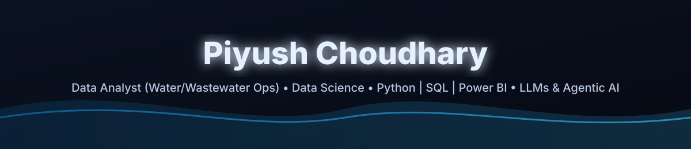

  

<h2 align="center">Hi 👋</h2>

  <b>Data Analyst (Water/Wastewater Ops)</b> • <b>Data Science & Scientific Computing</b> • <b>Python | SQL | Power BI</b> • <b>LLMs &amp; Agentic AI</b>

  
  
  

  
  
  

<h2>🚀 What I do</h2>

<ul>
  <li><b>Water &amp; Wastewater Ops Analytics</b> — automated reporting, KPI dashboards, QA checks, and cost/effort insights.</li>
  <li><b>Data Products</b> — pipelines → trusted metrics → dashboards → decisions.</li>
  <li><b>LLMs &amp; Agentic AI</b> — exploring RAG, tools, automation, and evaluation.</li>
</ul>

<h2>✨ Current Focus</h2>

<ul>
  <li>🌱 Advanced SQL, experimentation/product analytics, time series</li>
  <li>🧠 LLM engineering: RAG patterns, evaluation, and reliability</li>
  <li>🤝 Open to collaborations on analytics products, ML, and LLM tooling</li>
  <li>⚡ Fun fact: I built a tiny proof-of-work “Bitcoin mining” demo in Python years ago 😄</li>
</ul>

<h2>🧰 Top Skills</h2>

  

<h2>📊 GitHub Stats</h2>

  
  

  

  

  <b>Let’s connect:</b>
  <a href="https://www.linkedin.com/in/piyush-c3757" target="_blank">LinkedIn</a> •
  <a href="mailto:piyush99939@gmail.com">Email</a> •
  <a href="https://piyush-choudhary3757.github.io/My_site/" target="_blank">Portfolio</a>

